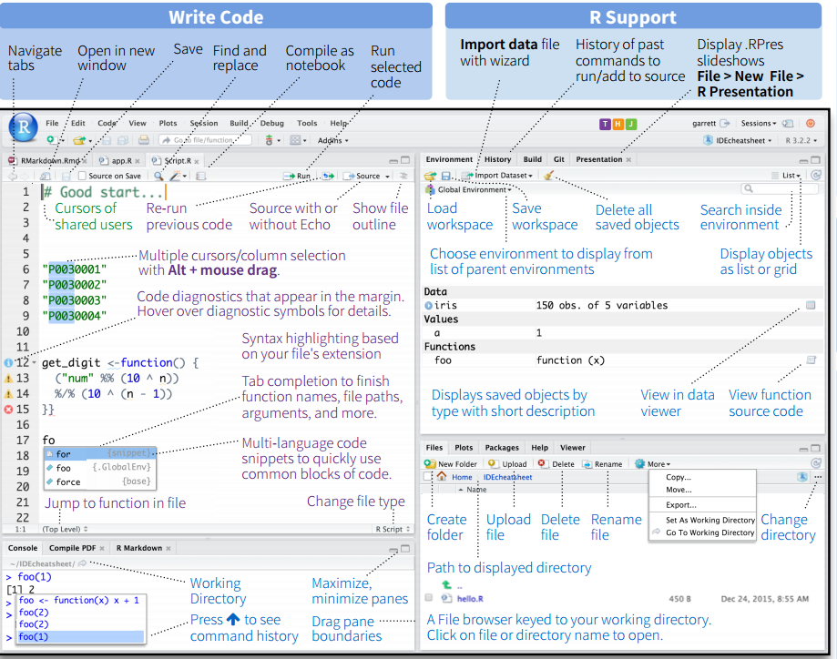

```{r setup, include=FALSE}
knitr::opts_chunk$set(echo = TRUE)
```

# Getting Started with R and RStudio

## Setting up your R Environment

First, download and install R ([https://www.r-project.org/](https://www.r-project.org/)) for your platform. 
Then download and install the 
RStudio Integrated Development Environment (IDE) ([https://www.rstudio.com/products/rstudio/download/](https://www.rstudio.com/products/rstudio/download/)). 

## RStudio


This screenshot is from the [RStudio Cheatsheet](https://www.rstudio.com/wp-content/uploads/2016/01/rstudio-IDE-cheatsheet.pdf).



RStudio 
is a free and open source IDE that is available on all computing platforms. 
RStudio provides a number of features that make working with R convenient 
including code completion, code highlighting, and tools to speed up literate 
(combining R code, R output, text, and figures in one document) programming in 
the R environment. 

RStudio has four main panes. The top left pane is the editor pane 
where you write and edit R script files. Bottom left is the R console where you 
can run commands, view the R command history, and see the current working directory. 
The top right by default shows you the contents of your current R environment 
including what datasets are currently stored in memory. The bottom right pane 
has the viewer pane which shows the file system, plots, R help, and directory 
of available packages. 

## Getting Help

R is an open-source platform with most of its content generated by users. To 
get started, we recommend browsing the manual provided by the R project itself:
([https://cran.r-project.org/manuals.html](https://cran.r-project.org/manuals.html)).
Start with the manual titled “An Introduction to R,” focusing on Chapter 1 
(Introduction and Preliminaries).

RStudio is well documented and includes a number of cheatsheets and quick start 
guides to help you easily find keyboard shortcuts and other features. You can 
find these in the "Help" tab of RStudio under "Cheatsheets".

For more help getting started with R here are some good introductions to R and 
sources of assistance:

- R Getting Started Guide [http://data.princeton.edu/R/gettingStarted.html](http://data.princeton.edu/R/gettingStarted.html)
- News about the R community [https://www.r-bloggers.com/](https://www.r-bloggers.com/)
- R skills for data science [http://r4ds.had.co.nz/](http://r4ds.had.co.nz/)
- Free R and RStudio tutorials [https://www.rstudio.com/online-learning/#R](https://www.rstudio.com/online-learning/#R)


## Project Organization

There are many ways to organize your work, but one helpful rule is to create a 
new folder for each analysis project. RStudio makes this easy with the idea of 
Projects. When you create a new project in RStudio it creates a new folder and 
launches R with the working directory set to that directory. 

Organizing in this way allows you to create a folder structure to keep big 
projects from sprawling. It is helpful to create subdirectories:

- data - to hold raw data for import
- cache - to save transformed data or intermediate calculations
- R - to save custom R functions

Using a folder scheme like this can allow you to use shorter more descriptive 
filenames and prevent accidental deletion or overwriting of critical files. 
As an added benefit, RStudio can autocomplete filenames and directories making 
it faster to navigate. 

You can create an R Project from within RStudio. Then you can open it using the 
project switcher in the top right of RStudio or by double clicking the `.Rproj` 
file in your filebrowser and opening it with R Studio.

## Opening the Toolkit

The toolkit is organized in just such a structure. Each section of the toolkit 
contains data files and three supporting files needed to complete the analyses:

- a PDF file that contains instructions, R code, and example output
- a `.Rmd` file that is used to generate the PDF file. It includes text and R 
code and can be run interactively within RStudio
- a `.R` script that contains only the R code used in the PDF and the `.Rmd` file 
above

These files assume the existence of a `data` subdirectory with three zip files 
containing the raw, clean, and analysis version of the toolkit data. 

There is also an `R` directory which contains a single R script for loading at 
the beginning of each toolkit session. This script defines a few custom functions 
to make using R for the toolkit easier. When you are in the project you can load 
all of these functions at once with the `source("R/functions.R")` command. 

To begin, open the PDF file that corresponds to the first Toolkit module you will 
work on. Then open the corresponding `.R` and `.Rmd` files and work along. 

Good luck!
