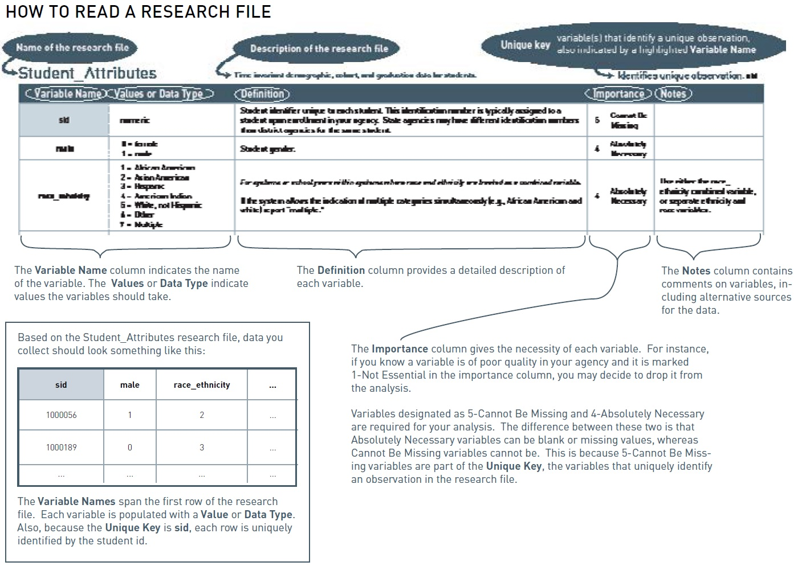
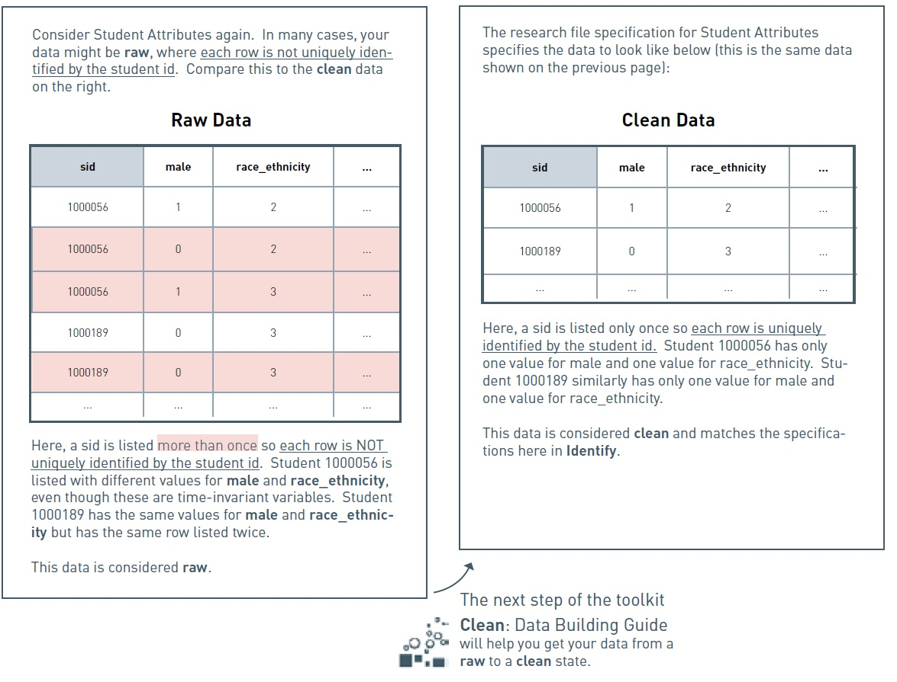

---
geometry: margin=.75in
---

# IDENTIFY: DATA SPECIFICATION GUIDE

## Introduction

Identify: Data Specification Guide is a resource to identify data elements
required to analyze student achievement, postsecondary attainment, and teacher
effectiveness data. To address these different areas, we organize data elements
into research files that contain important information at the student-, school-,
and teacher- levels. These research files comprise the elements needed to Clean,
Connect, and then Analyze your data.

\begin{small}
\bgroup
\def\arraystretch{1.5}
\begin{tabular}{p{.15\paperwidth} p{.52\paperwidth} p{.06\paperwidth} 
p{.06\paperwidth}  p{.06\paperwidth}}
\textbf{STUDENT DATA FILES}  &  & \textbf{College-going} &
\textbf{Human Capital} & \textbf{page} \\ 

Student\_Attributes & Demographic, cohort, and graduation data for students. & 
\cellcolor{blue!25} & \cellcolor{red!25} & 7 \\ 
Student\_School\_Year & School year and attendance data for students. & 
\cellcolor{blue!25} & \cellcolor{red!25} & 7 \\ 
Student\_School\_Enrollment & School enrollment/withdrawal data for students. &
\cellcolor{blue!25} & \cellcolor{red!25} & 7 \\ 
Student\_Class\_Enrollment & Class enrollment, grades, and credits earned for 
students & \cellcolor{blue!25} & \cellcolor{red!25} & 7 \\ 
Student\_Test\_Scores & Standardized test data for students (state standardized tests, 
advanced placement, SAT, ACT, etc.). Every attempt at a test by a student should 
be recorded. & \cellcolor{blue!25} & \cellcolor{red!25} & 7 \\ 
Student\_NSC\_Enrollment & The National Student Clearinghouse (NSC) Student 
Tracker student-level data report that provides information on postsecondary 
outcomes. & \cellcolor{blue!25} & \cellcolor{red!25} & 7 \\ \hline

\textbf{SCHOOL DATA FILES} & & & & \\

School & Location and classification of schools. & \cellcolor{blue!25} &
\cellcolor{red!25} & 7 \\ 
Class & Class level scheduling data. & 
\cellcolor{blue!25} & \cellcolor{red!25} & 7 \\ \hline

\textbf{STAFF DATA FILES} & & & & \\

Staff\_Attributes & Demographic and recruitment data of staff. & \cellcolor{blue!25} & \cellcolor{red!25} & 7 \\ 
Staff\_School\_Year & Pay, experience, school placement, and job codes of 
staff. & \cellcolor{blue!25} & \cellcolor{red!25} & 7 \\ 
Staff\_Degrees & Educational achievement of staff. Each degree a staff member 
received should be recorded once. & \cellcolor{blue!25} & \cellcolor{red!25} & 7 \\ 
Staff\_Certificaiton & Teaching Certifications received by staff. & 
\cellcolor{blue!25} & \cellcolor{red!25} & 7 \\ \hline

\end{tabular}
\egroup
\end{small}
## How to Read a Research File

## The Distinction Between Raw and Clean Data

\clearpage

## Advice on Collecting Your Data

If you gather your agency's data to work through the toolkit (rather than using 
the practice files) use these **"5 Ws of Data Collection"** to guide your efforts:

\bgroup
\def\arraystretch{2}

\begin{tabular}{p{.15\paperwidth} p{.15\paperwidth} p{.15\paperwidth} 
p{.15\paperwidth}  p{.15\paperwidth} }
\textbf{WHY}  & \textbf{WHAT} & \textbf{WHEN} &
\textbf{WHERE} & \textbf{WHO} \\ 

am I collecting data? & data are needed to answer these questions? & 
(over what date range) do I need data for? & are the data stored? & 
owns the systems where the data live and is responsible for delivery of the data? 
\\ 

What research questions am I trying to answer? & & How reliable are historical 
data? &  & \\ 

\end{tabular}
\egroup

## The Role of Database Architects

Database Architects play an important role equipping educational analysts and
data strategists with data. SDP recognizes that education agencies have
pre-established systems to collect and manage student-, teacher- and human
resource- databases. This toolkit enables database architects to pull data
available in pre-existing warehouses and transform it for analytic work. 
Database architects should feel free to modify the data specification to meet
their individual agency’s needs. However, to support analysts and data
strategists interested in pursuing the rest of the SDP Toolkit, following the
standards set in this specification will promote efficiencies in the way
variables are coded and defined.

## Data Files
\begin{landscape}
\Large Student\_Attributes
\vspace{-8mm}
\small
\singlespace
\begin{longtable}{| p{.1\paperheight} | p{.14\paperheight} | p{.32\paperheight} |
p{.07\paperheight} | p{.17\paperheight} | }
\caption*{Demographic, student, and graduation data for students} \\ \hline
\textbf{Variable Name}  & \textbf{Values or Data Type} & \textbf{Definition} &
\textbf{Importance} & \textbf{Notes} \\ \hline
sid  & numeric & Student identifier unique to each student. This identification 
number is typically assigned to students upon enrollment in your agency. State 
agencies may have different identification numbers than district agencies for 
the same student. & 5 Cannot be Missing & \\ \hline
male & 
\begin{itemize} \setlength\itemsep{-2pt}
\item[] 0 = female
\item[] 1 = male
\end{itemize} & Student gender & 4 Absolutely Necessary. & \\ \hline

race\_ethnicity & 
\begin{itemize} \setlength\itemsep{-2pt}
\item[] 1 = African American
\item[] 2 = Asian American
\item[] 3 = Hispanic
\item[] 4 = American Indian
\item[] 5 = White, not Hispanic
\item[] 6 = Other
\item[] 7 = Multiple
\end{itemize} & 
Student race and ethnicity. For systems where race and ethnicity are treated as a combined variable.
& 4 Absolutely Necessary & 

\footnotesize{Use either the race\_ethnicity combined variable, or separate ethnicity and 
race variables 

If the system allows the indication of multiple categories simultaneously 
(e.g., African American and white) report ``multiple''} \\ \hline

ethnicity & \begin{itemize} \setlength\itemsep{-2pt}
\item[] 0 = not Hispanic
\item[] 1 = Hispanic
\end{itemize} & Student ethnicity. For systems wehre race and ethnicity are treated 
as separate variables and Hispanic or Latino origin is asked as a separate question. 
& 4 Absolutely Necessary. & \footnotesize{Use either race\_ethnicity combined variable or 
separate ethnicity and race variables.} \\ \hline

birth\_date & \begin{itemize} \item[] date format \item[] yyyy-mm-dd 
\end{itemize}& Student birth date. & 2 Good to Have & 
\\ \hline
first\_9th\_school\_year\_reported & spring calendar year & 
The school year the student was a 9th grader for the first time. For this variable 
report what the system recorded for the 9th grade school year. Not all systems 
will record this information. & 1 Not Essential & \\ \hline
hs\_diploma & \begin{itemize} \setlength\itemsep{-2pt}
\item[] 0 = no high school diploma
\item[] 1 = has high school diploma
\end{itemize} & Indicator variable equal to 1 if the student received a high school 
diploma from the system & 4 Absolutely Necessary &  \\ \hline

hs\_diploma\_date & \begin{itemize} \setlength\itemsep{-2pt}
\item[] date format
\item[] (yyy-mm-dd)
\end{itemize} & The date on which the student received a high school diploma. 
If only a month and year, or only a school year, is known report the partial 
information. & 4 Absolutely Necessary & Can also be graduation date. \\ \hline
zip\_code & xxxxx or xxxxx-yyyy & The zip code of the student's home address. & 
1 Not Essential & \\ \hline

\end{longtable}
\vspace{-6mm}
\small{Identifies unique observation: \textbf{sid}}
\end{landscape}
\normalsize

\begin{landscape}
\Large{Student School Year}
\vspace{-8mm}
\small
\singlespace
\begin{longtable}{| p{.1\paperheight} | p{.14\paperheight} | p{.32\paperheight} |
p{.07\paperheight} | p{.17\paperheight} | }
\caption*{Yearly classification and attendance data for students.} \\ \hline
\textbf{Variable Name}  & \textbf{Values or Data Type} & \textbf{Definition} &
\textbf{Importance} & \textbf{Notes} \\ \hline
sid  & numeric & Student identifier unique to each student. This identification 
number is typically assigned to students upon enrollment in your agency. State 
agencies may have different identification numbers than district agencies for 
the same student. & 5 Cannot be Missing & \\ \hline

school\_year & spring calendar year & Academic school year from fall to spring 
denoted here as the spring calendar year. & 5 Cannot be missing & \\ \hline

grade\_level & \begin{itemize} \item[] -9 = ungraded \item[] -1 = any pre-kindergarten
\item[] 0 = kindergarten \item[] 1-12 = grades 1-12 \item[] 13+ = additional grade 
levels \end{itemize} & Student grade level & 4 Absolutely Necessary & Additional grade levels 
may include vocational training, special education past year 12 \\ \hline

frpl & \begin{itemize} \item[] 0 = not participating \item[] 1 = reduced lunch
\item[] 2 = free lunch \item[] null = no status \end{itemize} & 
Status in the free and reduced price lunch program. & 4 Absolutely Necessary & \\ 
\hline

iep & \begin{itemize} \item[] 0 = no IEP \item[] 1 = has IEP \end{itemize} & 
Indicator for students who have an individualized education plan (IEP). & 
4 Absolutely Necessary & \\ \hline

iep\_classification & use local values & Local IEP or special education classification.
Generally these classifications folow the standard special education classification. & 
2 Good to Have & \\ \hline

ell & \begin{itemize} \item[] 0 = not ell \item[] 1 = ell \end{itemize} & 
Indicator for students who are classified as English Language Learners (ELL). 
Some SYstems refer to this category as Limited English Proficienty (LEP) or 
English as a Second Language (ESL). & 4 Absolutely Necessary & \\ \hline

ell\_classification & use local values & Local classification of level of English 
language learner status. & 2 Good to Have & \\ \hline

gifted & \begin{itemize} \item[] 0 = not enrolled in a gifted education program 
\item[] 1 = enrolled in a gifted education program \end{itemize} & Indicator variable for students 
enrolled in gifted and talented education programs & 2 Good to Have & \\ \hline

gifted\_classification & use local values & Local classification, if any, 
for gifted eligible students. & 1 Not Essential & \\ \hline

total\_days\_ enrolled & number of days & Total number of days over the school 
year a student was enrolled. & 2 Good to Have & Can be calculated by school 
days between enrollment\_date and withdrawal\_date in Student\_School\_Enrollment 
for all schools or total\_days\_present + total\_days\_absent \\ \hline

total\_days\_ present & number of days & Total number of days over the school year 
a student was present. Cannot exceed the number of days enrolled. & 2 Good to Have 
& Can sometimes be unreliable. \\ \hline

total\_days\_absent & number of days & Total number of days over the school year 
a student was marked absent. Cannot exceed the number of days enrolled. & 2 Good 
to Have  & Can sometimes be unreliable. \\ \hline

days\_suspended\_ out\_of\_school & number of days & Total number of days over 
the school year a student experienced out of school suspension & 2 Good to Have & 
\\ \hline

days\_suspended\_ in\_school & number of days & Total number of days over 
the school year a student experienced in school suspension & 2 Good to Have & 
\\ \hline

\end{longtable}
\vspace{-6mm}
\small{Identifies unique observation: \textbf{sid + school\_year}}
\end{landscape}
\normalsize

\begin{landscape}
\Large{Student School Enrollment}
\vspace{-8mm}
\small
\singlespace
\begin{longtable}{| p{.1\paperheight} | p{.14\paperheight} | p{.32\paperheight} |
p{.07\paperheight} | p{.17\paperheight} | }
\caption*{School enrollment/withdrawal data for students.} \\ \hline
\textbf{Variable Name}  & \textbf{Values or Data Type} & \textbf{Definition} &
\textbf{Importance} & \textbf{Notes} \\ \hline

sid  & numeric & Student identifier unique to each student. This identification 
number is typically assigned to students upon enrollment in your agency. State 
agencies may have different identification numbers than district agencies for 
the same student. & 5 Cannot be Missing & \\ \hline

school\_year & spring calendar year & Academic school year from fall to spring 
denoted here as the spring calendar year. & 5 Cannot be missing & \\ \hline

school\_code & use local values & The local numeric or alpha-numeric code for the 
school. & 4 Absolutely Necessary & \\ \hline

enrollment\_date &\begin{itemize} \setlength\itemsep{-2pt}
\item[] date format
\item[] (yyy-mm-dd)
\end{itemize}  & When the student enrolled at the school. 
In some systems an enrollment date is recorded when a student matriculates from 
a different school (e.g. moving from an elementary to a middle school within the 
system or moveing from one middle school to a different middle school). 

In other systems enrollment dates are recorded at the beginning of each school year 
(e.g. 8th graders are assigned an enrollment date at the beginning of the year even 
if they were enrolled at the same school the year before). Th elatter case is 
perferred. It is also what we observe in most agencies. & 4 Absolutely Necessary
& \\ \hline

withdrawal\_date & \begin{itemize} \setlength\itemsep{-2pt}
\item[] date format
\item[] (yyy-mm-dd)
\end{itemize}  & The date the student withdrew from 
the school. 

In some systems the withdrawal date is recorded when the student moves to a 
different school (e.g. moving from elementary to middle school within the system, 
or moving from one middle school to a different middle school). 

In other systems withdrawal dates are recorded at the end of each school year (e.g. 
8th graders are assigned a withdrawal date at the end of the school year even if 
they plan to attend the same school next year). 

The latter case is preferred. & 4 Absolutely Necessary & \\ \hline

enrollment\_code & use local values & The local numeric or alpha-numeric code 
describing enrolment reason into the school, if available. & 1 Not Essential & 
\\ \hline

enrollment\_code \_desc & text & Description of the enrollment\_code. & 1 Not 
Essential & \\ \hline

withdrawal\_code & use local values & The local numeric or alpha-numeric code that 
describes the withdrawal reason from the school. & 4 Absolutely Necessary & \\ \hline

withdrawal\_code \_desc & text & Description of the withdrawal\_code. & 
4 Absolutely Necessary & \\ \hline

days\_enrolled & number of days & Number of school days during the school year 
the student was enrolled at a given school. The systems's data sources 
may report this directly or you may calculate it based on enrollment dates. & 
2 Good to Have & Can be calculated by days\_present + days\_absent \\ \hline

days\_present & number of days & Number of school days during the school year 
the student was present at a given school. The systems's data sources 
may report this directly or you may calculate it based on enrollment dates. & 
2 Good to Have & \\ \hline

days\_absent & number of days & Number of school days during the school year 
the student was absent at a given school. The systems's data sources 
may report this directly or you may calculate it based on enrollment dates. & 
2 Good to Have & \\ \hline

\end{longtable}
\vspace{-6mm}
\small{Identifies unique observation: \textbf{sid + school\_year + 
school\_code + enrollment\_date}}
\end{landscape}
\normalsize

\begin{landscape}
\Large{Student Class Enrollment}
\vspace{-8mm}
\small
\singlespace
\begin{longtable}{| p{.1\paperheight} | p{.14\paperheight} | p{.32\paperheight} |
p{.07\paperheight} | p{.17\paperheight} | }
\caption*{Class enrollment, grades, and credits earned data for students.} \\ \hline
\textbf{Variable Name}  & \textbf{Values or Data Type} & \textbf{Definition} &
\textbf{Importance} & \textbf{Notes} \\ \hline

sid  & numeric & Student identifier unique to each student. This identification 
number is typically assigned to students upon enrollment in your agency. State 
agencies may have different identification numbers than district agencies for 
the same student. & 5 Cannot be Missing & \\ \hline

cid & value from Class table, page (TODO) & Variable that links students to teachers 
by grouping students in the same room at the same time. One unique value should 
be assigned to each combination of variables: school\_year + school\_code + 
course\_code + section\_code + period\_bell + room\_number + tid & 
5 Cannot Be Missing & \\ \hline

class\_enrollment \_date & \begin{itemize} \setlength\itemsep{-2pt} 
\item[] date format
\item[] (yyy-mm-dd) \end{itemize} & The date the student enrolled in the class. 
In some cases an enrollment date may not be explicitly recorded in the system's 
data. Even if it is not recorded the enrollment date can often be derived. & 
2 Good to Have & Can be substituted with days enrolled in a course. \\ \hline

class\_withdrawal \_date & \begin{itemize} \setlength\itemsep{-2pt} 
\item[] date format
\item[] (yyy-mm-dd) \end{itemize} & The date the student withdrem from class. 
In some cases a withdrawal date may not be recorded in the system's 
data. Even if it is not explicitly recorded the enrollment date can often be 
derived. & 
2 Good to Have & Can be substituted with days enrolled in a course. \\ \hline

credits\_earned & use local values & The number of credits the student earned for 
the course. & 3 Necessary for Multiple Analyses & Can be calculated by using 
credits possible and credit attainment rules. \\ \hline

final\_grade\_mark & use local values & The final grade or mark the student 
recieved in the class. (``final'' means last, cumulative grade assigned). 
Grades can range from ``Alpha Plus'' (A+ through F), or a numeric scale (0.0 
- 4.0 or 0-100). & 4 Necessary for Multiple Analyses & \\ \hline

\end{longtable}
\vspace{-6mm}
\small{Identifies unique observation: \textbf{sid + cid + enrollment\_date}}
\end{landscape}
\normalsize

\begin{landscape}
\Large{Student Test Scores}
\small
\singlespace
\begin{longtable}{| p{.1\paperheight} | p{.14\paperheight} | p{.32\paperheight} |
p{.07\paperheight} | p{.17\paperheight} | }
\caption*{Standardized test data for students (state standardized tests, advanced placement, ACT, SAT, etc). Every attempt at a test by a student should be recorded.} \\ \hline
\textbf{Variable Name}  & \textbf{Values or Data Type} & \textbf{Definition} &
\textbf{Importance} & \textbf{Notes} \\ \hline

sid  & numeric & Student identifier unique to each student. This identification 
number is typically assigned to students upon enrollment in your agency. State 
agencies may have different identification numbers than district agencies for 
the same student. & 5 Cannot be Missing & \\ \hline

test\_code & use local values & These values identify individual tests (usually 
expressed as a sequence of letters and numbers). For example, a state test such 
as ``MCAS 6th Grade Math in Massachusetts'' or college entrance exam such as 
``SAT Math''. & 4 Absolutely Necessary & Can be concatenation of component variables 
below (e.g. test\_type and test\_subject) \\ \hline

test\_date & \begin{itemize} \setlength\itemsep{-2pt} 
\item[] date format
\item[] (yyy-mm-dd) \end{itemize} & The exact date (or at a minimum school year) 
the test was completed. Note that students who retake tests or are retained may 
have multiple observations for a single test\_code. These should be differentiated 
by test\_date. & 4 Absolutely Necessary &  \\ \hline

test\_code \_desc & text & Description of test\_code. & 4 Absolutely Necessary 
& \\ \hline

test\_type & use local values & The category of test, e.g. MCAS (state test), 
SAT, ACT, or AP. & 4 Absolutely Necessary & \\ \hline

grade\_level & \begin{itemize} \item[] -9 = ungraded \item[] -1 = any pre-kindergarten
\item[] 0 = kindergarten \item[] 1-12 = grades 1-12 \item[] 13+ = additional grade 
levels \end{itemize} & Numeric grade level of the test. May be unavailable for the 
SAT, ACT, or AP tests. & 2 Good to Have & Can be pulled from Student\_School \_Year
if not available here. \\ \hline 

test\_subject & \begin{itemize} \item[] 1 = math \item[] 2 = English language
\item[] 3 = science \item[] 4 = social studies \item[] 5 = other \item[] 6 = 
writing \end{itemize} & Subject of test. & 4 Absolutely Necessary & Subjects 
other than those listed can be numbered from 7 onwards. \\ \hline

test\_version & & Test version for different standardized exams in the same agency 
(e.g. SAT9 vs. STAR) & 2 Good to Have &  \\ \hline

language\_version & \begin{itemize} \item[] E = English 
\item[] S = Spanish \end{itemize} & Language of test. & 2 Good to Have &  \\ \hline

raw\_score & numeric & Student's raw score if available. May be unavailable for 
SAT, ACT, or AP tests. & 4 Absolutely Necessary & Any test score should be 
acquired including available percentile ranks. \\ \hline

scaled\_score & numeric & Student's scaled score. & 4 Absolutely Necessary & 
Any test score should be acquired including available percentile ranks. \\ \hline

performance\_level & code & Student's performance level (e.g. not proficient, 
proficient, advanced). May be unavailable for SAT, ACT, or AP tests. & 
2 Good to Have & \\ \hline

standardized\_score & numeric & If the system or state provides a standardized score 
(i.e. mean zero, s.d. one) for state tests include it, and note any information 
on what distributions was used for standardization. If the system or state 
does not provide a standardized score for state tests, leave this blank. & 
1 Not Essential & Can be calculated using scaled\_score with test\_code, test\_date, 
and grade\_level \\ \hline

\end{longtable}
\vspace{-6mm}
\small{Identifies unique observation: \textbf{sid + test\_code + test\_date}}
\end{landscape}
\normalsize

\begin{landscape}
\Large{Student NSC Enrollment}
\small
\singlespace
\begin{longtable}{| p{.1\paperheight} | p{.14\paperheight} | p{.32\paperheight} |
p{.07\paperheight} | p{.17\paperheight} | }
\caption*{National Student Clearinghouse Student Tracker student-level data that 
provides information on postsecondary outcomes.} \\ \hline
\textbf{Variable Name}  & \textbf{Values or Data Type} & \textbf{Definition} &
\textbf{Importance} & \textbf{Notes} \\ \hline

sid  & numeric & Student identifier unique to each student. This identification 
number is typically assigned to students upon enrollment in your agency. State 
agencies may have different identification numbers than district agencies for 
the same student. & 5 Cannot be Missing & \\ \hline

college\_code \_branch & use local values & OPE/FICE code of the college that the 
student attended. This is usually a six-digit college code followed by a hyphen 
and a two-digit branch code. & 2 Good to Have & \\ \hline

enrollment\_begin &  \begin{itemize} \setlength\itemsep{-2pt} 
\item[] date format
\item[] (yyy-mm-dd) \end{itemize} & Start of enrollment. & 4 Absolutely Necessary & 
\\ \hline

enrollment\_end &  \begin{itemize} \setlength\itemsep{-2pt} 
\item[] date format
\item[] (yyy-mm-dd) \end{itemize} & End of enrollment. & 4 Absolutely Necessary & 
\\ \hline

record\_found\_yn & 
\begin{itemize} \setlength\itemsep{-2pt} 
\item[] Y = yes
\item[] N = no \end{itemize} & Whether or not the NSC has college enrollment 
data for the student. & 4 Absolutely Necessar. & \\ \hline

high\_school\_code & use local values & Local code for the student's high school. & 
1 Not Essential &  \\ \hline

high\_school \_grad\_dt & 
\begin{itemize} \setlength\itemsep{-2pt} 
\item[] date format
\item[] (yyy-mm-dd) \end{itemize} & Student's high school graduation date; if 
graduated. & 1 Not Essential & \\ \hline

college\_name & text & The name of the college. & 2 Good to Have & \\ \hline

college\_state & two letter state abbreviation & The state where the college is 
located. & 2 Good to Have & \\ \hline

year4year & 
\begin{itemize} \setlength\itemsep{-2pt} 
\item[] 4 = 4-year
\item[] 2 = 2-year
\item[] L = Less than 2-year \end{itemize}  & Length of degree program. & 
4 Absolutely Necessary & ''L'' and ''2'' are typically grouped together. \\ \hline

public\_private & public / private & Type of college public or private. & 
2 Good to Have & \\ \hline

enrollment\_status & 
\begin{itemize} \setlength\itemsep{-2pt} 
\item[] A = leave of absence
\item[] D = deceased
\item[] F = full-time
\item[] H = half-time
\item[] L = less than half-time
\item[] W = withdrawn
\end{itemize} & Student's college enrollment status. & 3 Necessary for Multiple 
Analyses & \\ \hline

graduated & \begin{itemize} \setlength\itemsep{-2pt} 
\item[] Y = yes
\item[] N = no
\end{itemize} & Whether or not the student has graduated college. & 
2 Good to Have & \\ \hline

graduation\_date & \begin{itemize} \setlength\itemsep{-2pt} 
\item[] date format
\item[] (yyy-mm-dd) \end{itemize} & Student's college graduation date. & 
2 Good to Have & \\ \hline

college\_sequence & 1, 2, 3, ... & Sequence that student progresses through college. & 
1 Not Essential & \\ \hline

degree\_title & use local values & Degree title. & 1 Not Essential & \\ \hline
major & use local values & Student's major. & 1 Not Essential & \\ \hline

\end{longtable}
\vspace{-6mm}
\small{Identifies unique observation: \textbf{sid + college\_code\_branch + 
enrollment\_begin + enrollment\_end}}
\end{landscape}
\normalsize

\begin{landscape}
\Large{School}
\vspace{-8mm}
\small
\singlespace
\begin{longtable}{| p{.1\paperheight} | p{.14\paperheight} | p{.32\paperheight} |
p{.07\paperheight} | p{.17\paperheight} | }
\caption*{Yearly location and classification information for schools.} \\ \hline
\textbf{Variable Name}  & \textbf{Values or Data Type} & \textbf{Definition} &
\textbf{Importance} & \textbf{Notes} \\ \hline

school\_code & use local codes & The local numeric or alpha-numeric code for 
the school. & 4 Absolutely Necessary & \\ \hline

school\_year & spring calendar year & Academic school year from fall to spring 
denoted here as the spring calendar year. & 4 Absolutely Necessary & \\ \hline

school\_name & text & Name of school. & 4 Absolutely Necessary & \\ \hline 

pid & use local values & Principal identifier unique to each school. This 
identification number is typically assigned to a Principal upon entrance to agency. 
State agencies may have different identification numbers than district agencies 
for the same Principal. & 1 Not Essential & \\ \hline

campus\_code & use local values & Identifies the campus where the school is 
located, if co-located with other school. For example, when smaller 
schools-within-schools are established at a large traditional high school. & 
1 Not Essential & \\ \hline

local[district or cluster or etc] & use local values & One or more variables. 
The administrative sub-unit[s] to which the school is assigned. & 1 Not Essential & 
\\ \hline

grade\_span & \begin{itemize} \setlength\itemsep{-2pt} 
\item[] K-5
\item[] K-8
\item[] 6-8
\item[] 9-12
\item[] [or as appropriate]
\end{itemize} & The span of grade levels served by the school. Note this variable 
should reflect the intended grade span, not the actual grades observed. & 
1 Not Essential & A school with mostly K-5 students and a handful of 6th graders 
should not be recorded as K-6. \\ \hline

elementary & \begin{itemize} \setlength\itemsep{-2pt} 
\item[] 0 = not elementary school
\item[] 1 = elementary school 
\end{itemize} & Indicator variable identifying schools that serve grades K-5. & 
2 Good to Have & \\ \hline

middle & \begin{itemize} \setlength\itemsep{-2pt} 
\item[] 0 = not middle school
\item[] 1 = middle school 
\end{itemize} & Indicator variable identifying schools that serve grades 6-8. & 
2 Good to Have & \\ \hline

high & \begin{itemize} \setlength\itemsep{-2pt} 
\item[] 0 = not high school
\item[] 1 = high school 
\end{itemize} & Indicator variable identifying schools that serve grades 9-12. & 
2 Good to Have & \\ \hline

charter & \begin{itemize} \setlength\itemsep{-2pt} 
\item[] 0 = not charter school
\item[] 1 = charter school 
\end{itemize} & Indicator variable identifying schools which are charter schools. & 
4 Absolutely Necessary & \\ \hline

alternative & \begin{itemize} \setlength\itemsep{-2pt} 
\item[] 0 = not alternative school
\item[] 1 = alternative school 
\end{itemize} & Indicator variable identifying schools which are alternative 
schools. & 4 Absolutely Necessary & \\ \hline

sped & \begin{itemize} \setlength\itemsep{-2pt} 
\item[] 0 = not sped
\item[] 1 = sped
\end{itemize} & Indicator variable identifying schools which are special education  
schools (i.e. schools for the blind). & 4 Absolutely Necessary & \\ \hline

frpl & use local codes & Percent of students in a school with a status of free or 
reduced price lunch, calculated by the agency. & 2 Good to Have & 
May be used to group schools by poverty status. \\ \hline

\end{longtable}
\vspace{-6mm}
\small{Identifies unique observation: \textbf{school\_code + school\_year}}
\end{landscape}
\normalsize

\begin{landscape}
\Large{Class}
\vspace{-8mm}
\small
\singlespace
\begin{longtable}{| p{.1\paperheight} | p{.14\paperheight} | p{.32\paperheight} |
p{.07\paperheight} | p{.17\paperheight} | }
\caption*{Class level scheduling data.} \\ \hline
\textbf{Variable Name}  & \textbf{Values or Data Type} & \textbf{Definition} &
\textbf{Importance} & \textbf{Notes} \\ \hline

cid & numeric or string & Variable that links students to teachers 
by grouping students in the same room at the same time. One unique value should 
be assigned to each combination of variables: school\_year + school\_code + 
course\_code + section\_code + period\_bell + room\_number + tid & 
5 Cannot Be Missing & Constructed by the analyst to link students to teachers. 
\\ \hline

school\_year & spring calendar year & Academic school year from fall to spring, 
denoted here as the spring calendar year. & 5 Cannot Be Missing & \\ \hline

school\_code & use local values & The local numeric or alpha-numeric code for 
the school. & 4 Absolutely Necessary & \\ \hline

course\_code & use local values & The local numeric or alpha-numeric code for 
the course. A definition of how to interpret the variable or variables is 
important to capture in the codebook when the description of the code's 
sub-elements is not sufficient. & 4 Absolutely Necessary & \\ \hline

course\_code \_desc & text & Description of the course\_code. For example, 
"Pre-Algebra" or "English 7". & 4 Absolutely Necessary & \\ \hline

section\_code & use local values & The local numeric or alpha-numeric code that 
identifies individual sections. & 4 Absolutely Necessary & \\ \hline

period\_bell & use local values & The local numeric or alpha-numeric code for 
the period when the class meets. & 2 Good to Have & \\ \hline

room\_number & use local values & The local numeric or alpha-numeric code for the 
classroom where class meets. & 2 Good to Have & \\ \hline

tid & numeric & Unique teacher or student identifier. State agencies may have 
different identification numbers than district agencies for the same staff/teacher. & 
4 Absolutely Necessary & Staff includes teachers and other agency employees. \\ 
\hline

semester\_term \_year & \begin{itemize} \setlength\itemsep{-2pt} 
\item[] 100 = year long course
\item[] 010 = first semester course
\item[] 020 = second semster course
\item[] 001 = first term course
\item[] 002 = second term course
\item[] 004 = fourth term course
\end{itemize} & The duration of the class and when the class occurred during the 
school year. (i.e. year, semester, or term). & 2 Good To Have & \\ \hline

graduation \_requirement & \begin{itemize} \setlength\itemsep{-2pt} 
\item[] 0 = not required for high school graduation
\item[] 1 = required for high school graduation
\end{itemize} & Indicator variable for all high school level courses required 
for graduation. & 3 Necessary for Multiple Analyses & \\ \hline

credits\_possible & use local values & Credits possible from the course. & 
1 Not Essential & \\ \hline

instructional\_level & \begin{itemize} \setlength\itemsep{-2pt} 
\item[] 1 = remedial
\item[] 2 = standard
\item[] 3 = honors/advanced
\end{itemize} & Instructional level of the course. & 2 Good to Have & Sometimes 
embedded in course code or course title. \\ \hline

subject & \begin{itemize} \item[] 1 = math \item[] 2 = English language
\item[] 3 = science \item[] 4 = social studies \item[] 5 = other 
\end{itemize} & General subject matter of the course. & 3 Necessary for Multiple 
Analyses & Sometimes embedded in course code or course title. \\ \hline

\end{longtable}
\vspace{-6mm}
\small{Identifies unique observation: \textbf{cid}}
\end{landscape}

\begin{landscape}
\Large{Staff Attributes}
\vspace{-8mm}
\small
\singlespace
\begin{longtable}{| p{.1\paperheight} | p{.14\paperheight} | p{.32\paperheight} |
p{.07\paperheight} | p{.17\paperheight} | }
\caption*{Time invariant demographic and recruitment data related to staff.} \\ \hline
\textbf{Variable Name}  & \textbf{Values or Data Type} & \textbf{Definition} &
\textbf{Importance} & \textbf{Notes} \\ \hline

tid & numeric & Unique teacher or student identifier. State agencies may have 
different identification numbers than district agencies for the same staff/teacher. & 
4 Absolutely Necessary & Staff includes teachers and other agency employees. \\ 
\hline

male & \begin{itemize} \setlength\itemsep{-2pt} 
\item[] 0 = female
\item[] 1 = male
\end{itemize} & Staff gender. & 2 Good to Have & \\ \hline

race\_ethnicity & 
\begin{itemize} \setlength\itemsep{-2pt}
\item[] 1 = African American
\item[] 2 = Asian American
\item[] 3 = Hispanic
\item[] 4 = American Indian
\item[] 5 = White, not Hispanic
\item[] 6 = Other
\item[] 7 = Multiple
\end{itemize} & 
Student race and ethnicity. For systems where race and ethnicity are treated 
as a combined variable. & 4 Absolutely Necessary & 

Use either the race\_ethnicity combined variable, or separate ethnicity and 
race variables 

If the system allows the indication of multiple categories simultaneously 
(e.g., African American and white) report ``multiple'' \\ \hline

race & \begin{itemize} \setlength\itemsep{-2pt}
\item[] 1 = African American
\item[] 2 = Asian American
\item[] 4 = American Indian
\item[] 5 = White
\item[] 6 = Other
\item[] 7 = Multiple
\end{itemize} & For systems where race and ethnicity are treated as a separate variable. If 
the system allows for multiple categories (e.g. African-American and white) 
report "multiple".
& 4 Absolutely Necessary & 

Use either the race\_ethnicity combined variable, or separate ethnicity and 
race variables 

If the system allows the indication of multiple categories simultaneously 
(e.g., African American and white) report ``multiple'' \\ \hline

ethnicity & \begin{itemize} \setlength\itemsep{-2pt}
\item[] 0 = not Hispanic
\item[] 1 = Hispanic
\end{itemize} & Student ethnicity. For systems wehre race and ethnicity are treated 
as separate variables and Hispanic or Latino origin is asked as a separate question. 
& 4 Absolutely Necessary. & Use either race\_ethnicity combined variable or 
separate ethnicity and race variables \\ \hline

birth\_date & \begin{itemize} \item[] date format \item[] yyyy-mm-dd 
\end{itemize}& Staff birth date. & 1 Not Essential & 
\\ \hline

zip\_code & xxxxx or xxxxx-yyyy & The zip code of the staff member's home address. 
& 1 Not Essential & \\ \hline

offer\_date\_first & \begin{itemize} \item[] date format \item[] yyyy-mm-dd 
\end{itemize}& The date the staff member was offered a job. & 2 Good to Have & 
\\ \hline

offer\_date\ \_most\_recent & \begin{itemize} \item[] date format \item[] yyyy-mm-dd 
\end{itemize}& If the staff member left and was re-hired, the most recent date 
they were offered a job to work in the system. & 2 Good to Have & 
\\ \hline

hire\_date\_first & \begin{itemize} \item[] date format \item[] yyyy-mm-dd 
\end{itemize}& The date the staff member was hired to work. & 2 Good to Have & 
\\ \hline

hire\_date \_most\_recent & \begin{itemize} \item[] date format \item[] yyyy-mm-dd 
\end{itemize}& If the staff member left and was re-hired the most recent date 
they were hired to work in the system. & 2 Good to Have & \\ \hline

termination\_date \_first &  \begin{itemize} \item[] date format \item[] yyyy-mm-dd 
\end{itemize}& The first date staff members terminated employment. & 
1 Not Essential & \\ \hline

termination\_date \_most\_recent & \begin{itemize} \item[] date format \item[]
yyyy-mm-dd \end{itemize} & If the staff member left, was re-hired, and then left 
again, the most recent date they left the system. & 1 Not Essential & \\ \hline

certification\_path & use local values & The teacher's certification pathway. 
For example, "university/college", "alternative", or "uncertified". & 
2 Good to Have & Where data exists, TFA or NYC Teaching Fellows can be included. 
\\ \hline

\end{longtable}
\vspace{-6mm}
\small{Identifies unique observation: \textbf{tid}}
\end{landscape}
\normalsize

\begin{landscape}
\Large{Staff School Year}
\vspace{-8mm}
\small
\singlespace
\begin{longtable}{| p{.1\paperheight} | p{.14\paperheight} | p{.32\paperheight} |
p{.07\paperheight} | p{.17\paperheight} | }
\caption*{Yearly pay, experience, school placement, and job codes for staff.} \\ \hline
\textbf{Variable Name}  & \textbf{Values or Data Type} & \textbf{Definition} &
\textbf{Importance} & \textbf{Notes} \\ \hline

tid & numeric & Unique teacher or student identifier. State agencies may have 
different identification numbers than district agencies for the same staff/teacher. & 
5 Cannot Be Missing & Staff includes teachers and other agency employees. \\ 
\hline

school\_year & spring calendar year & Academic school year from fall to spring, 
denoted here as the spring calendar year. & 5 Cannot Be Missing & \\ \hline

salary\_group\_code & use local values & 
Seaparate variables that describe different components of salary. For example: 
salary\_group\_degree, salary\_group\_experience, salary\_group\_nbct etc. 
Identifies the teacher's base slaary, and genearally includes a component 
for experience, degrees earned, and other considerations (e.g. NBTS certification). 
A definition of how to interpret the variable or variables is particularly 
important to caputre in the codebook. & Only necessary if we do not know teaching 
experience and advanced degree. & \\ \hline

additional\_pay & amount & The amount of salary above the base salary (captured in 
salary\_group\_code) which the staff member received. & 1 Not Essential & \\ \hline

teaching\_ experience & 0 or positive integer & Identifies the total teaching 
experience of the staff member in years. (0 denotes a new teacher). & 
4 Absolutely Necessary & Can be backed out from salary. Note: we only need to 
differentiate between the first 1-5 years. It is okay (but not ideal) to 
group more experienced teachers together. \\ \hline

district\_experience & 0 or positive integer & Identifies teaching experience of the 
staff member as an employee of the district. & 2 Good to Have & \\ \hline

school\_code1 & use local values & The local code for the primary school in which a 
staff member is employed. & 4 Absolutely Necessary & Can be determined from course file
\\ \hline

job\_code1 & use local values & The local code for the job or position held 
in the primary school. & 2 Good to Have & \\ \hline

school\_code2 & use local values & The local code for the secondary school, if 
more than 1. & 1 Not Essential & \\ \hline

job\_code2 & use local values & The local code for the job or position held 
in the secdonary school. & 2 Good to Have & \\ \hline

school\_code\# & use local values & The local code for the \#th school, if more 
than two. & 4 Absolutely Necessary & Can be determined from course file
\\ \hline

job\_code\# & use local values & The local code for the job or position held 
in the \#th school. & 2 Good to Have & \\ \hline

\end{longtable}
\vspace{-6mm}
\small{Identifies unique observation: \textbf{tid + school\_year}}
\end{landscape}
\normalsize

\begin{landscape}
\Large{Staff Degrees}
\vspace{-8mm}
\small
\singlespace
\begin{longtable}{| p{.1\paperheight} | p{.14\paperheight} | p{.32\paperheight} |
p{.07\paperheight} | p{.17\paperheight} | }
\caption*{Educational achievement for staff. Each degree a staff member has received should be recorded.} \\ \hline
\textbf{Variable Name}  & \textbf{Values or Data Type} & \textbf{Definition} &
\textbf{Importance} & \textbf{Notes} \\ \hline

tid & numeric & Unique teacher or student identifier. State agencies may have 
different identification numbers than district agencies for the same staff/teacher. & 
5 Cannot Be Missing & Staff includes teachers and other agency employees. \\ 
\hline

degree\_year & \begin{itemize} \item[] 1 = less than four year degree
\item[] 2 = four year degree \item[] 3 = master's degree \item[] 4 = doctoral degree
\end{itemize} & The type of degree received by the staff member. & 
3 Necessary for Multiple Analyses & Can be backed out from salary grade. \\ \hline

degree\_institution \_code & use local codes & Local code for the degree granting 
institution. & 2 Good to Have & \\ \hline

degree\_date &  \begin{itemize} \item[] date format \item[] yyyy-mm-dd 
\end{itemize} & The date (or at minimum year) on which the degree was granted. & 
1 Not Essential & \\ \hline

degree\_opeid & OPEIDs & OPEID for the degree granting institution. Identification 
number used by the U.S. Department of Education's Office of Postsecondary Education 
(OPE) to identify schools. & 2 Good to Have & Can be obtained from a sample 
match if degree\_institution name is known. \\ \hline

degree\_major & use local codes & Description of the dgree major or subject. & 
2 Good to Have & \\ \hline

\end{longtable}
\vspace{-6mm}
\small{Identifies unique observation: \textbf{tid + degree\_type + 
degree\_institution\_code + degree\_date}}
\end{landscape}

\begin{landscape}
\Large{Staff Certifications}
\vspace{-8mm}
\small
\singlespace
\begin{longtable}{| p{.1\paperheight} | p{.14\paperheight} | p{.32\paperheight} |
p{.07\paperheight} | p{.17\paperheight} | }
\caption*{Teaching certifications received by staff.} \\ \hline
\textbf{Variable Name}  & \textbf{Values or Data Type} & \textbf{Definition} &
\textbf{Importance} & \textbf{Notes} \\ \hline

tid & numeric & Unique teacher or student identifier. State agencies may have 
different identification numbers than district agencies for the same staff/teacher. & 
5 Cannot Be Missing & Staff includes teachers and other agency employees. \\ 
\hline

certification\_code & use local codes & One or more variables (e.g. grade level 
may be separate from subject, area). Local code for the type or class of 
certification or license. & 2 Good to Have & \\ \hline

certification\_ effective\_date & \begin{itemize} \item[] 
date format \item[] yyyy-mm-dd\end{itemize} & The date the certification took 
effect. & 2 Good to Have & School year can also be used. \\ \hline

certification\_code\_ desc & text & Descriptive text for certification\_code & 
2 Good to Have & \\ \hline

certification\_ expire\_date & \begin{itemize} \item[] date format \item[] yyyy-mm-dd 
\end{itemize} & The date when certification expired or expires. & 2 Good to Have 
& School year can also be used. \\ \hline

special\_education & \begin{itemize} \item[] 0 = not special education certified 
\item[] 1 = special education certified \end{itemize} & An indicator variable 
for staff with Special Education certification. & 1 Not Essential & \\ \hline

english\_language\_ learners & \begin{itemize} \item[] 0 = not English language 
learners certified  \item[] 1 = English language learners certified \end{itemize} 
& An indicator variable for staff with English language learners certification. 
& 1 Not Essential & \\ \hline

nbct & \begin{itemize} \item[] 0 = not National Board certified
\item[] 1 = National Board certified \end{itemize} & An indicator variable 
for staff that are National Board certified. & 2 Good to Have & \\ \hline

\end{longtable}
\vspace{-6mm}
\small{Identifies unique observation: \textbf{tid + certification\_code + 
certification\_effective\_date}}
\end{landscape}

\vfill
Last updated January 2017.

© 2016 President and Fellows of Harvard College. 
